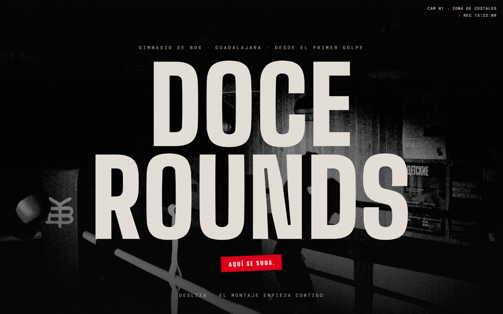
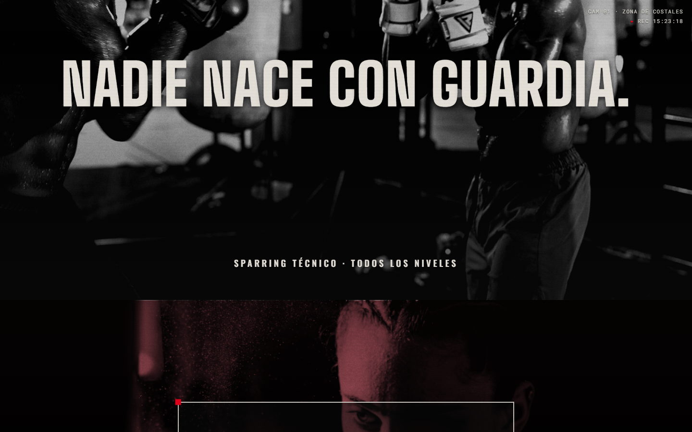

# DOCE ROUNDS — Gimnasio de box · Tu primer round es gratis

**Ver en vivo → [https://b0b1a6ae23.github.io/doce-rounds/](https://b0b1a6ae23.github.io/doce-rounds/)**


Landing con lenguaje de **montaje de entrenamiento**: cortes de impacto, sellos de
round, timers y count-ups — la energía de un gym de box traducida a scroll puro.

| Hero | Sección |
| --- | --- |
|  |  |

## Técnicas

- **Cortes de impacto**: flash + shake disparados `onEnter` una sola vez (nunca
  scrubbed — un golpe no se reproduce en reversa).
- Sellos "ROUND N" con `back.out(2.5)` + ondas expansivas.
- Timers y count-ups con `snap` para números enteros.
- Duotono rojo con `mix-blend-mode: multiply` sobre fotografía real.
- Overlay CCTV con timestamp vivo y marquees con `timeScale` según velocidad de scroll.
- Tipografía: Big Shoulders + Oswald + Roboto Mono.

## Responsive

Diseñado responsive desde el primer trazo: breakpoints espejados CSS ↔
`gsap.matchMedia`, `svh`, guards `(hover: hover)` y safe-areas.

## Cómo correr

```bash
npx http-server . -p 8080
```

## Licencia

Código bajo licencia [MIT](LICENSE). **DOCE ROUNDS** es una marca ficticia creada para demostrar trabajo de portafolio; cualquier parecido con un negocio real es coincidencia. Los recursos de terceros (fotografías, videos y modelos 3D) conservan la licencia original de sus autores — ver Créditos.

## Créditos

Fotografía: [Pexels](https://www.pexels.com).

---
**Ángel Josué García Cantero** · Serie *páginas-película*.